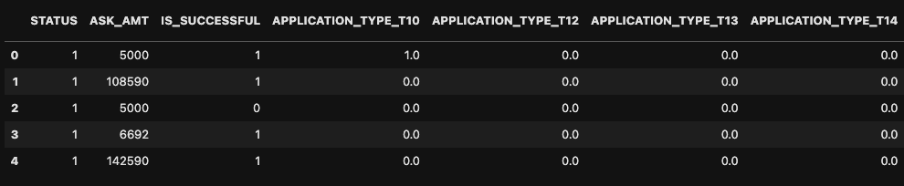
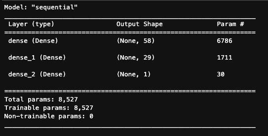
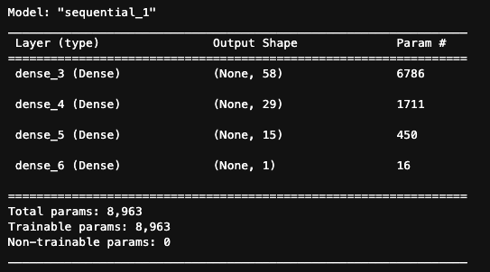
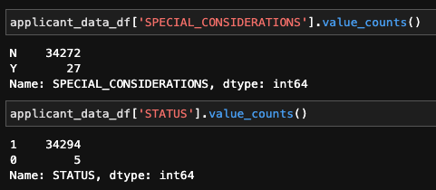
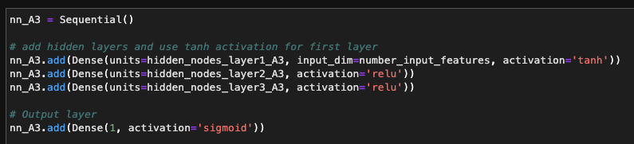

# VC Funding DNN Classification - UW FinTech Bootcamp Module 13 Challenge 

In this project I create and compare 4 deep neural networks trained to predict if a company will be successful if funded by a theoretical venture capital firm. These models are binary classification models that are evaluated on their accuracy to predict the yes/no values of if the company was successful after being funded. 

This is a TensorFlow project that I run on an M1 Mac, but it can be viewed in Google Colab! -> 

### Data Used
[applicants_data.csv](./Resources/applicants_data.csv) - Theoretical data of companies and their funding information; Label is the IS_SUCCESSFUL column

### Summary

I start by collecting the data then one-hot encoding the non-numeric data, split the data using scikitlearn's train_test_split(), and scaling the data using scikitlearn's StandardScaler()

I then define my first model that simply uses all features, two hidden layers with ReLU activation functions, a sigmoid output layer, and is evaluated using binary crossentropy with an adam optimizer. The number of nodes in each layer are defined by `(number_of_features + 1) // 2` and `(hidden_layer_1_nodes + 1) // 2`. Each of the models created are TensorFlow Sequential() models with Dense() layers. 

Then I attempt to optimize by first creating a model that is exactly the same as the first but instead has a third hidden layer with a node count of `(hidden_layer_2_nodes + 1) // 2`. 

Next I create another model that is exactly like the first model but instead removes the SPECIAL_CONSIDERATIONS and STATUS features as they appear to be less predictive. 

Finally, I create a model that tries many different hyperparameters. This model uses three hidden layers with tanh and ReLU activation functions, the Adamax function is used as an optimizer, and the model is only trained for 20 epochs compared to 50 for all the other models. 

### Results

The results of each model were about the same and none of them were significantly better than the others. Many variations of hyperparameter tunings were used and these were the best performances. If I were to expand on this dataset for better accuracy I may instead try different models since an accuracy of around 0.73 seemed to be the best performance I could get with a deep neural network. Even just using one hidden layer provided about the same performance. 

* Model 1 - All features and two hidden layers
    * loss: 0.5552
    * accuracy: 0.7300
* Model 2 - Increased number of hidden layers
    * loss: 0.5617
    * accuracy: 0.7294
* Model 3 - Reduced number of features
    * loss: 0.5571
    * accuracy: 0.7297
* Model 4 - Reduced number of features, 3 hidden layers, ReLU/tanh activators, Adamax optimizer, and 20 epochs
    * loss: 0.5507
    * accuracy: 0.7318

---

## Technologies

This is a Python 3.8 project ran in Google Colab but can be used in JupyterLab using a Conda dev environment. 

The following dependencies are used: 
1. [Jupyter](https://jupyter.org/) - Running code 
2. [Conda](https://github.com/conda/conda) (4.13.0) - Dev environment
3. [Pandas](https://github.com/pandas-dev/pandas) (1.3.5) - Data analysis
4. [Matplotlib](https://github.com/matplotlib/matplotlib) (3.5.1) - Data visualization
5. [Numpy](https://numpy.org/) (1.21.5) - Data calculations + Pandas support
6. [TensorFlow](https://www.tensorflow.org/) (2.0.0+) - Deep neural network creation
7. [Keras](https://keras.io/about/) (2.9.0) - Deep neural network creation
8. [Scikit-learn](https://scikit-learn.org/stable/index.html) (1.1.3) - Machine learning tools and methods

---

## Installation Guide

If you would like to run the program in JupyterLab, install the [Anaconda](https://www.anaconda.com/products/distribution) or [Miniforge for M1 Macbooks](https://github.com/conda-forge/miniforge) distribution and run `jupyter lab` in a conda dev environment. 

I use an M1 Macbook which cannot directly support TensorFlow, but [this guide](https://github.com/mrdbourke/m1-machine-learning-test) can be followed to install Apple's version of TensorFlow. For this specific dataset, it is likely better to use an M1 Macbook's CPU rather than GPU which is why I included the `tf.config.set_visible_devices([], 'GPU')` in the first cell of [venture_funding_with_deep_learning.ipynb](./venture_funding_with_deep_learning.ipynb).

To ensure that your notebook runs properly you can use the [requirements.txt](/Resources/requirements.txt) file to create an exact copy of the conda dev environment used in development of this project. 

Create a copy of the conda dev environment with `conda create --name myenv --file requirements.txt`

Then install the requirements with `conda install --name myenv --file requirements.txt`

---

## Usage

The Jupyter notebook [venture_funding_with_deep_learning.ipynb](./venture_funding_with_deep_learning.ipynb) will provide all steps of the data collection, preparation, and analysis. Data visualizations are shown inline and accompanying analysis responses are provided. It can be uploaded to Google Colab with the provided .csv files in `/Resources`, or can be viewed in the [GitHub uploaded version](https://colab.research.google.com/github/ethansilvas/vc-funding-dnn-classification/blob/main/GC_venture_funding_with_deep_learning.ipynb)

---

## Contributors

[Ethan Silvas](https://github.com/ethansilvas)

---

## License

This project uses the [GNU General Public License](https://choosealicense.com/licenses/gpl-3.0/)